# 🌐 FlowTalk — Smart Multilingual Communication Platform


---

## Overview

FlowTalk is a real-time multilingual chat platform that breaks language barriers using AI translation. Users communicate naturally in their preferred language while others see messages translated instantly.

---

## Key Features

- Real-time translation for 12+ languages  
- Smart glossary preservation for technical terms  
- Multilingual voice messaging with transcription  
- Animated emoji reactions  
- Toggle between original/translated messages  
- Community & channel-based organization  

---

## System Architecture

```mermaid
flowchart TB
    subgraph Client[" Client Layer"]
        UI[Next.js Frontend]
        Auth[Auth Context]
        Chat[Chat Components]
    end
    
    subgraph API["🔌 API Layer"]
        AuthAPI[Auth Routes]
        MsgAPI[Message Routes]
        CommAPI[Community Routes]
    end
    
    subgraph Services[" Service Layer"]
        MsgSvc[Message Service]
        TransSvc[Translation Engine]
        Cache[Translation Cache]
        Glossary[Glossary Manager]
    end
    
    subgraph External[" External"]
        LingoAPI[Lingo.dev API]
    end
    
    subgraph Data["Database"]
        MongoDB[(MongoDB)]
    end
    
    UI --> AuthAPI
    UI --> MsgAPI
    MsgAPI --> TransSvc
    TransSvc --> LingoAPI
    TransSvc --> Cache
    Cache --> MongoDB
    MsgSvc --> MongoDB
```



---

## System Workflow


---

## Tech Stack

<table align="center">
<tr>
<td align="center" width="140">

<br><b>Next.js 16</b>
<br><sub>React Framework</sub>
</td>
<td align="center" width="140">

<br><b>React 19</b>
<br><sub>UI Library</sub>
</td>
<td align="center" width="140">

<br><b>TypeScript 5</b>
<br><sub>Type Safety</sub>
</td>
<td align="center" width="140">

<br><b>MongoDB 7</b>
<br><sub>Database</sub>
</td>
<td align="center" width="140">

<br><b>Tailwind 4</b>
<br><sub>Styling</sub>
</td>
</tr>
<tr>
<td align="center" width="140">

<br><b>Mongoose</b>
<br><sub>ODM</sub>
</td>
<td align="center" width="140">

<br><b>Framer Motion</b>
<br><sub>Animations</sub>
</td>
<td align="center" width="140">

<br><b>Lucide React</b>
<br><sub>Icons</sub>
</td>
<td align="center" width="140">

<br><b>Lingo.dev</b>
<br><sub>Translation API</sub>
</td>
<td align="center" width="140">

<br><b>Jest 30</b>
<br><sub>Testing</sub>
</td>
</tr>
</table>

</div>


---

## Quick Start

```bash
git clone https://github.com/your-username/flowtalk.git
cd flowtalk/multilingual-chat
npm install
cp .env.example .env.local
npm run dev
```

Open → http://localhost:3000

---

## Environment Variables

```env
MONGODB_URI=your_mongodb_uri
JWT_SECRET=your_jwt_secret
LINGO_API_KEY=your_lingo_api_key
```

---

## Project Structure

```text
flowtalk/
├── src/
│   ├── app/
│   ├── components/
│   ├── services/
│   ├── lib/
│   └── types/
├── public/
└── package.json
```

---

## API Endpoints

| Method | Endpoint | Description |
|---------|-------------|----------------|
POST | /api/auth/register | User registration |
POST | /api/auth/login | User login |
GET | /api/messages | Get messages |
POST | /api/messages | Send message |
GET | /api/communities | List communities |
POST | /api/communities | Create community |

---

## Author

Tejas Rawool  
https://github.com/TejasRawool186

---
Demo Video: [FlowTalk - real-time multilingual chat app](https://t.co/7fyb7fdgcu)
## License

MIT License — see LICENSE file for details.

---

If FlowTalk helps break language barriers — give the repo a star!
